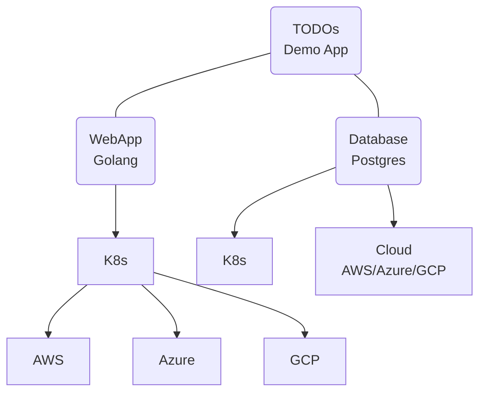

# TODOs

A simple TODO demo app with two components: A web-app written in Golang and a database based on Postgres.

The goal is to demonstrate multi-cloud scenarios where the web-app app and the database are deployed on different providers. 




# Getting started

## K8s

Prerequisite: A Kubernetes cluster. e.g. [emma's Managed Multi-Cloud Kubernetes](https://docs.emma.ms/project-services/managed-kubernetes-service/)

```sh
# setup database
kubectl apply -f k8s/postgres.yaml
kubectl port-forward -n todos service/postgres 5432:5432
psql -h localhost -U postgres todos
CREATE TABLE todos (item TEXT PRIMARY KEY);
INSERT INTO todos (item) VALUES ('Buy groceries'), ('Finish homework'), ('Clean the house');
SELECT * FROM todos;

# change / build application see Makefile

# start application
kubectl apply -f k8s/todos.yaml
kubectl port-forward -n todos service/todos 3000:3000

open http://localhost:3000
```

## Troubleshooting

```sh
# logs
kubectl logs -f -l app=todos -n todos --all-containers=true

# base connectivity
kubectl run netcat --rm -it --image=alpine -- sh
nc -zv postgres 5432

# psql
kubectl run psql-client --rm -it --image=postgres -- bash
psql -h postgres -U postgres 
```

# Notes
Inspired by https://blog.logrocket.com/building-simple-app-go-postgresql/