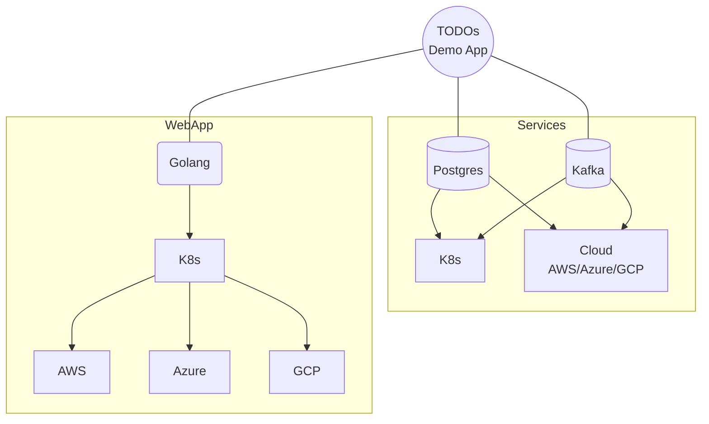

# TODOs

A simple TODO demo app with two components: A web-app written in Golang and a database based on Postgres.

The goal is to demonstrate multi-cloud scenarios where the web-app app and the database are deployed on different providers. 




# Getting started

## K8s

Prerequisite: A Kubernetes cluster. e.g. [emma's Managed Multi-Cloud Kubernetes](https://docs.emma.ms/project-services/managed-kubernetes-service/)

```sh
# work in todos namespace
kubectl create ns todos; kubectl config set-context --current --namespace=todos

# setup a simple database
kubectl apply -f k8s/postgres.yaml
kubectl port-forward -n todos service/postgres 5432:5432
psql -h localhost -U postgres todos
# dummy data
CREATE TABLE todos (
    item TEXT PRIMARY KEY,
    username TEXT
);
INSERT INTO todos (item, username) VALUES ('Buy groceries', 'Matthias'), ('Finish homework', 'Matthias'), ('Clean the house', 'Matthias');

# setup a simple kafka
kubectl apply -f k8s/kafka.yaml
# create topic
kubectl run kafka-client --rm -it --image=apache/kafka -- bash
cd /opt/kafka/bin/
./kafka-topics.sh --bootstrap-server kafka:9092 --create --topic todos-topic

# Build application. See Makefile.
# Change the Docker user
make push

# start application
kubectl apply -f k8s/todos.yaml
kubectl port-forward -n todos service/todos 3000:3000
open http://localhost:3000

# make it available publicly:
# get the clusters hostname and add it to ingress.yaml
kubectl apply -f k8s/ingress.yaml
open <hostname>
```

## Troubleshooting

```sh
# watch
watch --color kubecolor get pods -o wide -n todos  --force-colors

# logs
kubectl logs -f -l app=todos -n todos --all-containers=true

# base connectivity
kubectl run netcat --rm -it --image=alpine -- sh
nc -zv postgres 5432

# psql
kubectl run psql-client --rm -it --image=postgres -- bash
psql -h postgres -U postgres 

# kafka
./kafka-console-producer.sh --bootstrap-server kafka:9092 --topic todos-topic
./kafka-console-consumer.sh --bootstrap-server kafka:9092 --topic todos-topic --from-beginning
```

# Notes
Inspired by https://blog.logrocket.com/building-simple-app-go-postgresql/