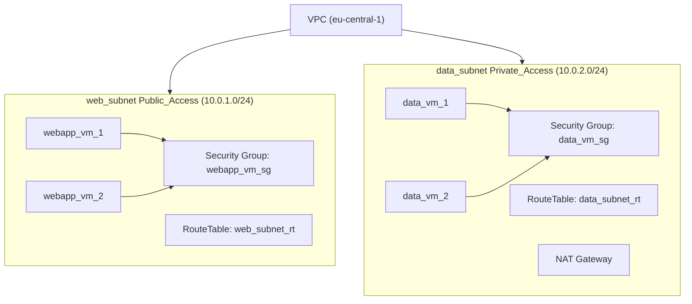

# Setting up VMs with AWS


## Create Infra
```sh
# Configure & Test AWS access
aws sts get-caller-identity

tofu init
tofu plan
tofu apply

chmod 600 id_rsa_todos.pem
```

## SSH Access
```sh
PUBLIC_IP_APP_1=$(tofu show --json | jq -r '.values.root_module.resources[] | select(.address=="aws_instance.webapp_vm_1").values.public_ip')
ssh -i id_rsa_todos.pem ubuntu@$PUBLIC_IP_APP_1

PUBLIC_IP_APP_2=$(tofu show --json | jq -r '.values.root_module.resources[] | select(.address=="aws_instance.webapp_vm_2").values.public_ip')
ssh -i id_rsa_todos.pem ubuntu@$PUBLIC_IP_APP_2
```

## Network overview



```shell
aws ec2 describe-vpcs --filters "Name=tag:Name,Values=main_vpc"

aws ec2 describe-subnets --filters "Name=tag:Name,Values=web_subnet,data_subnet" | jq -r .Subnets[].SubnetId

aws ec2 describe-instances --filters "Name=tag:Name,Values=webapp_vm_1,webapp_vm_2,data_vm_1,data_vm_2" | jq '.Reservations[].Instances[0].InstanceId'
```

## Configure App

```sh
# Check if service came up
systemctl status docker
cat /var/log/cloud-init-output.log

# Save the app image
docker save luebken/todos -o todos.save
# Configure serivce
sed -i '' 's/{DATABASE_URL}/'"$DATA_PRIVATE_IP1"'/g' ../todos.service
 # Upload app image & service
scp -i id_rsa_todos.pem ../todos.service todos.save ubuntu@$PUBLIC_IP_APP_1:/home/ubuntu

ssh -i id_rsa_todos.pem ubuntu@$PUBLIC_IP_APP_1
# load image
sudo docker load --input todos.save

# Setup and start the service
# sudo chown root:root todos.service
sudo mv todos.service /etc/systemd/system/

sudo systemctl enable todos
sudo systemctl start todos
sudo systemctl status todos

# Troubleshooting
sudo journalctl -u todos.service
sudo systemctl daemon-reload
sudo systemctl stop todos
```


## Configure Database

```sh
# Access to data VMs
# We use the first WebVM as a bastion host
PRIVATE_DATA_IP1=$(tofu show --json | jq -r '.values.root_module.resources[] | select(.address=="aws_instance.data_vm_1").values.private_ip')
# memorize the private IP
echo $PRIVATE_DATA_IP1 > PRIVATE_DATA_IP1.txt
# copy private key to bastion host
scp -i id_rsa_todos.pem PRIVATE_DATA_IP1.txt id_rsa_todos.pem ubuntu@$PUBLIC_IP_APP_1:/home/ubuntu
# on the bastion host
export PRIVATE_DATA_IP1=$(cat PRIVATE_DATA_IP1.txt)
ssh -i id_rsa_todos.pem ubuntu@$PRIVATE_DATA_IP1

# Check if service came up
cat /var/log/cloud-init-output.log
systemctl status postgresql
```
See also https://dev.to/gdenn/aws-best-practices-three-tier-vpc-37n0